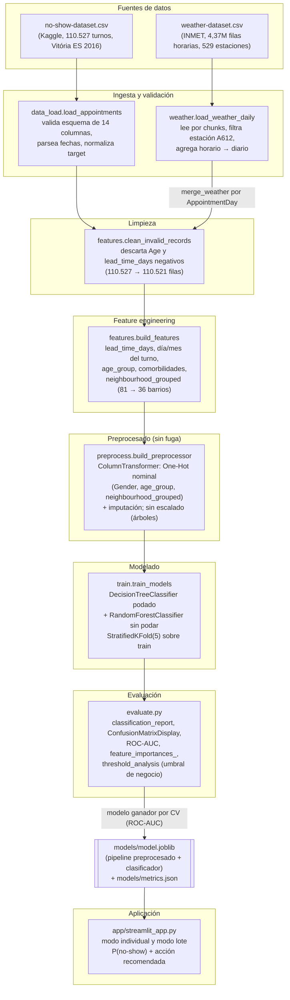

# Arquitectura — Predicción de no-show en turnos médicos

TPO de Ciencia de Datos (UADE, Grupo 7). Este documento describe la tubería de datos
completa, desde las fuentes crudas hasta la aplicación interactiva, y el stack técnico
usado en cada etapa. La audiencia de este documento es Gerencia Técnica.

## Diagrama de la tubería de datos

## Descripción de las etapas

### 1. Fuentes de datos

- **Turnos médicos** (`data/raw/no-show-dataset.csv`, ~10,7 MB): dataset público de
  Kaggle con 110.527 turnos ambulatorios de la red de salud de Vitória (ES, Brasil),
  abril-junio de 2016. Incluye datos demográficos del paciente, comorbilidades, si
  recibió recordatorio por SMS y el target `No-show` ("Yes"/"No").
- **Clima horario INMET** (`data/raw/weather-dataset.csv`, ~437 MB): datos meteorológicos
  horarios de 529 estaciones de Brasil en 2016. Se usa como **segunda fuente de datos**
  (expectativa superadora del TP), filtrando la estación **A612 (Vitória, ES)** — la
  misma ciudad de origen de los turnos — para explorar si el clima del día del turno se
  asocia al no-show.

Ambos crudos no se versionan en git por tamaño (`.gitignore`); solo se versiona el clima
diario ya agregado (`data/external/weather_daily_a612.csv`, ~22 KB), reproducible a
partir del crudo.

### 2. Ingesta y validación

- `noshow.data_load.load_appointments`: carga el CSV de turnos, valida que estén
  presentes las 14 columnas esperadas (`config.APPOINTMENTS_SCHEMA`), parsea
  `ScheduledDay`/`AppointmentDay` a datetime y normaliza el target crudo `No-show`
  ("Yes"/"No") a `no_show` (1/0) + `target_name` (`no_show`/`show`).
- `noshow.weather.load_weather_daily`: lee el CSV crudo de clima **por chunks**
  (`chunksize=200_000`), filtrando únicamente la estación `A612` antes de acumular en
  memoria (nunca materializa los 437 MB completos), y agrega horario → diario
  (precipitación total, temperatura máx/mín/media, humedad media, `is_rainy`). El
  resultado se cachea en `data/external/` para no reprocesar el crudo en corridas
  posteriores.

### 3. Limpieza

- `noshow.features.compute_lead_time_days` + `clean_invalid_records`: calcula
  `lead_time_days` (días entre agendamiento y turno) y descarta registros con `Age`
  negativa o `lead_time_days` negativo (110.527 → 110.521 filas), dejando constancia en
  el log de cuántos registros se descartan por cada motivo.

### 4. Feature engineering

- `noshow.features.build_features`: orquesta la derivación de variables predictoras —
  `appointment_dow`/`appointment_month`/`same_day`, `age_group` (bins etarios),
  `comorbidity_count`/`has_comorbidity` (hipertensión, diabetes, alcoholismo,
  discapacidad) y `neighbourhood_grouped` (agrupa en `"OTHER"` los barrios de baja
  frecuencia, reduciendo la cardinalidad de 81 a 36 categorías antes del one-hot).
- El cruce de clima (`noshow.weather.merge_weather`) ocurre **antes** de esta etapa,
  uniendo por `AppointmentDay`; los turnos sin clima disponible para su fecha quedan
  marcados con `weather_missing=1` en lugar de romper el pipeline.
- `noshow.features.build_processed_dataset` orquesta todo el flujo (carga → clima →
  features) y cachea el resultado en `data/processed/appointments_processed.csv`, de
  forma determinística y reutilizable tanto por el entrenamiento como por el notebook.

### 5. Preprocesado (sin fuga de datos)

- `noshow.preprocess.build_preprocessor`: arma un `ColumnTransformer` de scikit-learn
  — One-Hot Encoding (`handle_unknown="ignore"`) de las categóricas nominales
  (`Gender`, `age_group`, `neighbourhood_grouped`) e imputación simple (mediana en
  numéricas, moda en categóricas). Las variables numéricas **no se escalan**, ya que los
  modelos de árbol no lo requieren. El `ColumnTransformer` se ajusta **únicamente sobre
  el conjunto de entrenamiento** y se persiste dentro del mismo `Pipeline` que el
  clasificador, garantizando la misma transformación en entrenamiento e inferencia (sin
  fuga de datos).

### 6. Modelado

- `noshow.train.train_models`: split hold-out estratificado (80/20,
  `stratify=y`, `random_state=42`); entrena un **Árbol de Decisión podado**
  (`max_depth=6`, `min_samples_leaf=50`) y un **Random Forest sin podar**
  (`n_estimators=300`, `max_depth=12`, `min_samples_leaf=5`, `max_features="sqrt"`);
  compara ambos con `StratifiedKFold(n_splits=5, shuffle=True, random_state=42)` sobre
  train (F1 y ROC-AUC, media ± desvío estándar) y elige el modelo final por ROC-AUC de
  CV (robusto al desbalance ~80/20, a diferencia de F1 a un umbral fijo de 0,5).

### 7. Evaluación

- `noshow.evaluate`: `classification_report`, `ConfusionMatrixDisplay`, curva ROC +
  `roc_auc_score` sobre el hold-out de test; `feature_importances_` del Random Forest y
  `plot_tree`/`export_text` del árbol podado para interpretabilidad;
  `threshold_analysis` para el ajuste de umbral orientado a recall (costo asimétrico
  FN vs FP: un no-show no detectado es más caro que un recordatorio de más).

### 8. Artefacto persistido

- `noshow.train.save_artifacts` persiste el pipeline ganador completo (preprocesado +
  clasificador) en `models/model.joblib` (vía `joblib`) y las métricas/hiperparámetros
  en `models/metrics.json`, para que tanto la app como cualquier script de scoring
  batch carguen el mismo artefacto sin tener que reentrenar.

### 9. Aplicación interactiva

- `app/streamlit_app.py` consume `models/model.joblib` a través de
  `noshow.predict` (`predict_appointment`, `predict_batch`, `recommend_action`) para
  traducir la probabilidad de no-show en una acción de negocio por bandas de riesgo
  (`config.RISK_LOW`/`RISK_HIGH`): modo turno individual (inputs → probabilidad +
  acción) y modo lote (subir CSV de agenda → tabla rankeada por riesgo).

## Stack técnico

| Capa | Herramienta |
|---|---|
| Manipulación de datos | `pandas`, `numpy` |
| Modelado | `scikit-learn` (`DecisionTreeClassifier`, `RandomForestClassifier`, `ColumnTransformer`, `Pipeline`) |
| Persistencia del modelo | `joblib` |
| Visualización / EDA | `matplotlib`, `seaborn` |
| Notebook | `jupyter` / `nbconvert` |
| Aplicación interactiva | `streamlit` |
| Testing | `pytest` |
| Metodología | CRISP-DM + gestión ágil + versionado en GitHub |

## Notas de diseño

- **Sin fuga de datos**: el preprocesado (`ColumnTransformer`) se ajusta solo sobre
  train y viaja dentro del mismo `Pipeline` persistido que el clasificador — la app y
  cualquier script de inferencia aplican exactamente la misma transformación que se usó
  en entrenamiento.
- **Segunda fuente de datos real**: el clima no se simula ni se consulta a una API
  externa; se deriva del propio dataset horario de INMET, filtrando la estación
  correspondiente a la ciudad de origen de los turnos (A612, Vitória).
- **Alineación a cátedra con divergencias justificadas**: se sigue el molde de la
  materia (CRISP-DM, DT podado + RF sin podar, One-Hot, `StratifiedKFold`,
  `classification_report`/`ConfusionMatrixDisplay`/ROC-AUC, `feature_importances_` y
  `plot_tree`), con dos divergencias deliberadas y documentadas en
  `openspec/changes/noshow-prediction/design.md`: `ColumnTransformer`/`Pipeline`
  persistido con el modelo (en vez de `get_dummies` suelto) y `stratify=y` en el split,
  ambas necesarias para que la app funcione sin fuga de datos y de forma reproducible.
